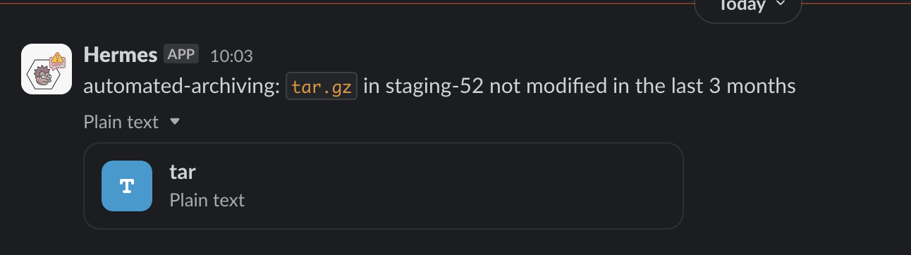

# Automated Archiving

#### python v3.8.17

## Summary
This script automates archiving projects and directories on DNAnexus platform - runs on the 1st and 15th of each month. 
It finds 002 / 003 projects, directories in 001_stagingarea52 and directories in precision brain projects which fit the pre-determined criteria for archiving, send notification to Slack and perform archiving in the next run.

## What does the script do
Check for 002 003 projects, directories in staging52, folders in "precision" projects which are not modified in the last X months (inactive) and send Slack notification to notify. Archiving happens on the next run (for example, if project A is notified for archiving on Slack on the 1st, it will be archived on the 15th when the script runs again)

Tag `never-archive` in projects.setting to skip archiving permanently.
Tag `never-archive` in a file in directories in staging-52 to skip archiving for that directory.

## Typical use case
Check for archivable projects or directories or folders in "precision" projects on DNANexus, send Slack notification and archive them.

## Archive Pickle
The script generates a pickle file at location specified at `AUTOMATED_ARCHIVE_PICKLE_PATH`.

## Member
The script requires `members.ini` with section [members]. See example in repo. Mount the `members.ini` to read the file

```
-v /<path>/<to>/members.ini:/members.ini:ro
```

## Workflow
1. If 1st or 15th, check memory (pickle) for archivable projects, directories, precision folders
    - if yes, run archiving.
2. Find archivable projects
3. Send Slack notification on those projects

## Example Notification

#### 003 Slack Notification


#### tar.gz Slack Notification


## Environment Variables Required
#### dnanexus
- `DNANEXUS_TOKEN` : DNANexus API Token
- `PROJECT_52` : staging52 project-id
#### general envs
- `AUTOMATED_MONTH_002` : period (in months) before being marked for archiving (e.g. 3) for 002 projects
- `AUTOMATED_MONTH_003` : period (in months) before being marked for archiving (e.g. 1) for 003 projects
- `AUTOMATED_CEN_WES_MONTH`: period (in months) before being marked for archiving (e.g. 6) for CEN/WES projects
- `AUTOMATED_ARCHIVE_PICKLE_PATH` : pickle file (memory) directory pathway
- `ARCHIVING_LOGGING_PATH`: path for logging
- `TAR_MONTH`: period (in months) for `tar.gz` being inactive to be considered 'old enough'
- `ARCHIVE_MODIFIED_MONTH`: period (in months) to determine whether to skip archiving if project or file is modified within this month (e.g. 1)
- `ARCHIVE_DEBUG`: env to comment out actionable codes (e.g. tag file, remove file tag, archive)
- `AUTOMATED_REGEX_EXCLUDE`: comma-separated regex word e.g. megaqc.json,some-filename\..*,^megapc.csv
- `PRECISION_ARCHIVING`: comma separated project-id that need specific archiving (folder by folder archiving)
#### slack
- `SLACK_TOKEN` : Slack Bot API Token

## Logging
The main logging script is `helper.py`

The script will generate a log file `automated-archiving.log` in `ARCHIVING_LOGGING_PATH`

## Tags
There are 2 tags recognized by the script:
- `never-archive`
- `archive`

#### #never-archive
Projects tagged will bypass archiving indefintely, same goes to any directory within staging52.

#### #archive
Tagged project will be listed for archiving, regardless of modified date

## Docker
`Dockerfile` is included for rebuilding docker image

To rebuild image: `docker build -t <image name> .`

Current docker command (server):

```docker run --env-file <path to environment file> -v <path>/members.ini:/members.ini:ro -v <path to logging directory>:/monitoring archive --datetime 20240131```

- optional argument `datetime` to override script datetime

## Automation
A cron job can be set up to run the script on 1st and 15th of each month
