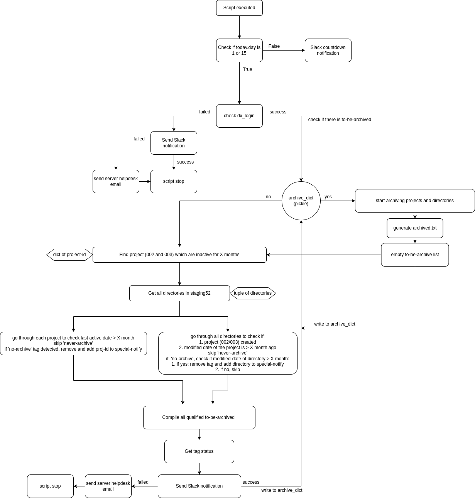
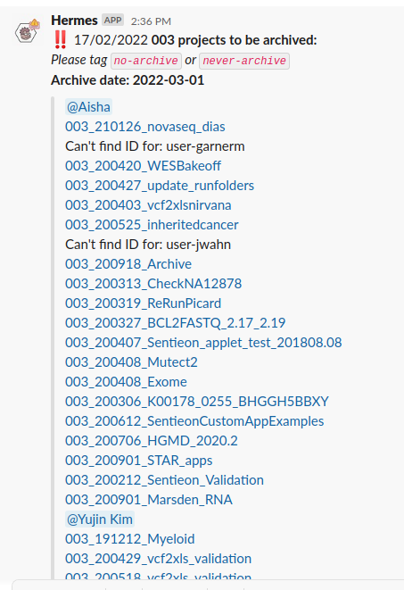

# Automated Archiving

## What does the script do
Check for 002, 003 projects and directories in staging52 which are not modified for the last X months (inactive). Compile all archivable into a list and send Slack notification to notify all to-be-archived files in the next run. Tag `no-archive` or `never-archive` to skip archiving.

## Typical use case
Monthly check for archivable projects or directories on DNANexus & send Slack notification

## Archive Pickle
The script generates a pickle file at location specified at `AUTOMATED_ARCHIVE_PICKLE_PATH`. This acts as the memory of the script to remember to-be-archived projects and files + all archived.

## Script Workflow
When the script is executed, it checks if today is 1st or 15th of a month, if it is, it check for files in memory (to_be_archived, staging52). 
```
archive_pickle = read_or_new_pickle(ARCHIVE_PICKLE_PATH)
to_be_archived = archive_pickle['to_be_archived']
staging52 = archive_pickle['staging_52']

if today.day in [1, 15]:
    if to_be_archived or staging52:
        archiving_function(archive_pickle)
    else:
        find_projs_and_notify(archive_pickle)
```
If there is, it runs the archiving function, skipping those tagged with either `no-archive` or `never-archive`. 

If there is nothing in the lists, it proceeds to find projects and directories which have been inactive for the last X months.

If today is not 1st or 15th, it check for the next run date and send a countdown to Slack



## Example Slack Notification


## Configs required
A config file (txt) with variables:
- `DNANEXUS_TOKEN` : DNANexus API Token
- `SLACK_TOKEN` : Slack Bot API Token
- `PROJECT_52` : staging52 project-id
- `PROJECT_53` : staging53 project-id
- `AUTOMATED_MONTH_002` : Period of file being inactive after which to archive (months) for 002 projects & generally
- `AUTOMATED_MONTH_003` : Period of file being inactive after which to archive (months) for 003 projects
- `AUTOMATED_ARCHIVE_PICKLE_PATH` : pickle file directory
- `AUTOMATED_ARCHIVED_TXT_PATH` : directory to output txt file listing all archived projects & directories
- `ANSIBLE_SERVER`: (for sending helpdesk email) server host
- `ANSIBLE_PORT`: (for sending helpdesk email) server port
- `SENDER`: (for sending helpdesk email) BioinformaticsTeamGeneticsLab@addenbrookes.nhs.uk
- `RECEIVERS`: (for sending helpdesk email) emails separated by comma (e.g. abc.domain,bbc.domain)

## Logging
The main logging script is `helper.py`

The script will generate a log file `automated-archiving.log` in `/var/log/monitoring`

## Tags
There are two tags recognized by the script:
- `no-archive`
- `never-archive`

#### no-archive
Projects tagged will temporarily bypass archiving. For directories in staging52, if one or more files within a directory (`/210202_A12905_003`) is tagged, the whole directory will temporarily bypass archiving. 

The tag will be removed if a project or directory remain inactive for X months (`MONTH_002`)

#### never-archive
Projects tagged will bypass archiving indefintely, same goes to any directory within staging52.


## Output file
The script will generate a txt file `archived.txt` at the location specified at `AUTOMATED_ARCHIVED_TXT_PATH`. 

The text file contains all the archived project-id and directories in `staging52`

## Docker
`Dockerfile` is included for rebuilding docker image

To rebuild image: `docker build -t <image name> .`

Current tested command (local):

```docker run --env-file <config.txt> -v /var/log:/var/log <image name> ```

## Automation
A cron job will be set up to run the script on 1st and 15th of each month
